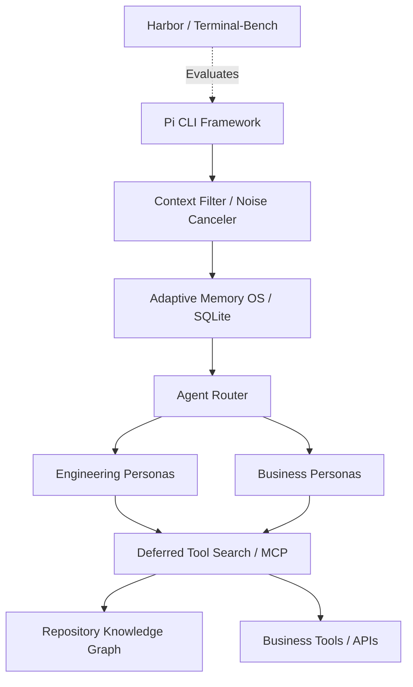

# System Architecture

## Overview
The custom CLI will act as a "Swiss Army Knife" for both coding and business operations. It will be built as a suite of extensions and skills on top of the **Pi CLI** (`pi.dev`) framework. This leverages Pi's native multi-agent system, MCP adapters for deep knowledge-graph integration, and robust TUI, allowing us to focus on extreme token efficiency.

## High-Level Architecture Diagram

## LLM Integration & Provider Routing
The system abstracts the LLM interface using a **Provider Router** pattern, allowing seamless swapping between local and cloud models without changing agent logic:
1. **Local Models (Ollama)**: Because Ollama exposes an OpenAI-compatible REST API, we can route inference locally by pointing the base URL to `http://127.0.0.1:11434/v1`. This allows completely offline, free execution using models like `llama3` or `qwen`.
2. **Cloud Models**: The router natively supports major tech company LLMs (OpenAI, Anthropic, Google Gemini). Users configure their preferred models and API keys in the global `~/.swissrc` file. The CLI handles request translation and token counting depending on the selected provider.
3. **Major and Minor Model Tiering**: The architecture explicitly supports setting a **Major** model and a **Minor** model. 
   - **Major Model**: Used for heavy reasoning, deep architectural coding, and complex business logic (e.g., GPT-4o, Claude 3.7, Gemini Pro).
   - **Minor Model**: Used for fast, lightweight tasks like parsing intent, routing commands, tool search embedding, and noise cancellation (e.g., a local Ollama model, Claude Haiku, or GPT-4o-mini).
   - *Flexibility*: The user can mix and match—using a local Ollama model as the Minor and Anthropic as the Major, or using cloud providers for both.
