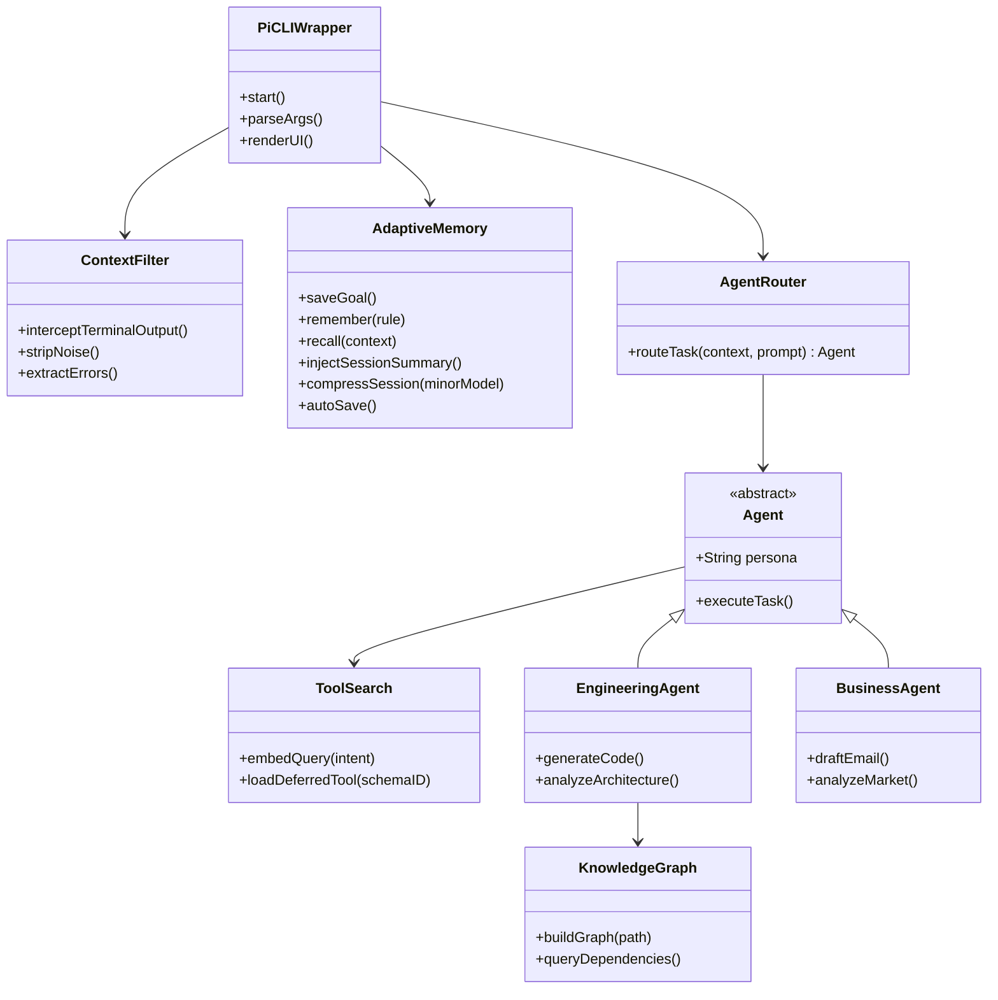

# Class Diagram

```mermaid
classDiagram
    class PiCLIWrapper {
        +start()
        +parseArgs()
        +renderUI()
    }
    class ContextFilter {
        +interceptTerminalOutput()
        +stripNoise()
        +extractErrors()
    }
    class AdaptiveMemory {
        +saveGoal()
        +remember(rule)
        +recall(context)
        +injectSessionSummary()
        +compressSession(minorModel)
        +autoSave()
    }
    class AgentRouter {
        +routeTask(context, prompt) Agent
    }
    class Agent {
        <<abstract>>
        +String persona
        +executeTask()
    }
    class ToolSearch {
        +embedQuery(intent)
        +loadDeferredTool(schemaID)
    }
    class EngineeringAgent {
        +generateCode()
        +analyzeArchitecture()
    }
    class BusinessAgent {
        +draftEmail()
        +analyzeMarket()
    }
    class KnowledgeGraph {
        +buildGraph(path)
        +queryDependencies()
    }

    PiCLIWrapper --> ContextFilter
    PiCLIWrapper --> AdaptiveMemory
    PiCLIWrapper --> AgentRouter
    AgentRouter --> Agent
    Agent --> ToolSearch
    Agent <|-- EngineeringAgent
    Agent <|-- BusinessAgent
    EngineeringAgent --> KnowledgeGraph
```
