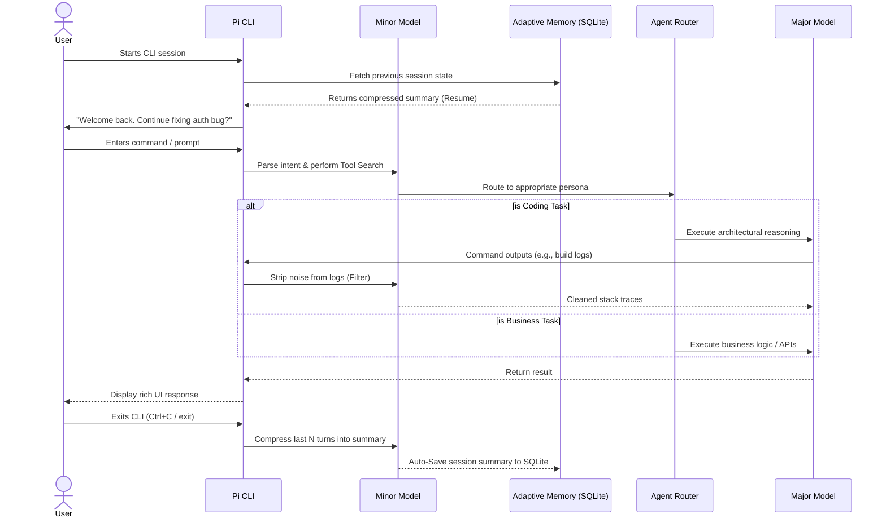

# User Flow

```mermaid
sequenceDiagram
    actor User
    participant CLI as Pi CLI
    participant MinorModel as Minor Model
    participant Memory as Adaptive Memory (SQLite)
    participant Router as Agent Router
    participant MajorModel as Major Model
    
    %% Session Startup (Resume)
    User->>CLI: Starts CLI session
    CLI->>Memory: Fetch previous session state
    Memory-->>CLI: Returns compressed summary (Resume)
    CLI->>User: "Welcome back. Continue fixing auth bug?"
    
    %% Task Execution
    User->>CLI: Enters command / prompt
    CLI->>MinorModel: Parse intent & perform Tool Search
    MinorModel->>Router: Route to appropriate persona
    
    alt is Coding Task
        Router->>MajorModel: Execute architectural reasoning
        MajorModel->>CLI: Command outputs (e.g., build logs)
        CLI->>MinorModel: Strip noise from logs (Filter)
        MinorModel-->>MajorModel: Cleaned stack traces
    else is Business Task
        Router->>MajorModel: Execute business logic / APIs
    end
    
    MajorModel-->>CLI: Return result
    CLI-->>User: Display rich UI response
    
    %% Session Shutdown (Auto-Save)
    User->>CLI: Exits CLI (Ctrl+C / exit)
    CLI->>MinorModel: Compress last N turns into summary
    MinorModel-->>Memory: Auto-Save session summary to SQLite
```
